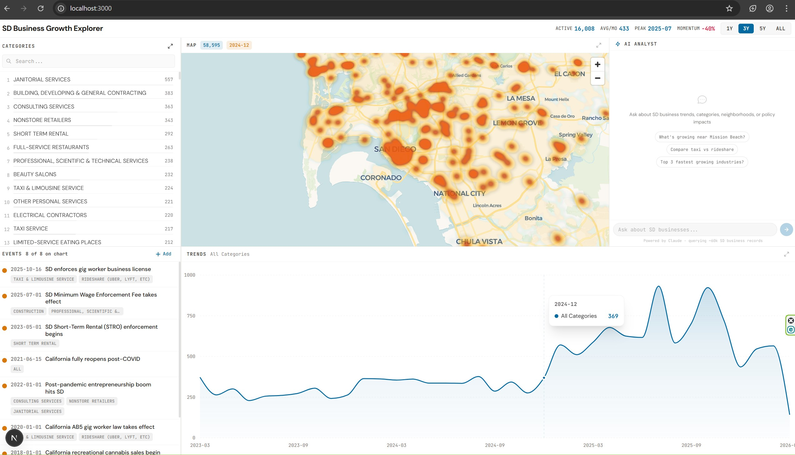
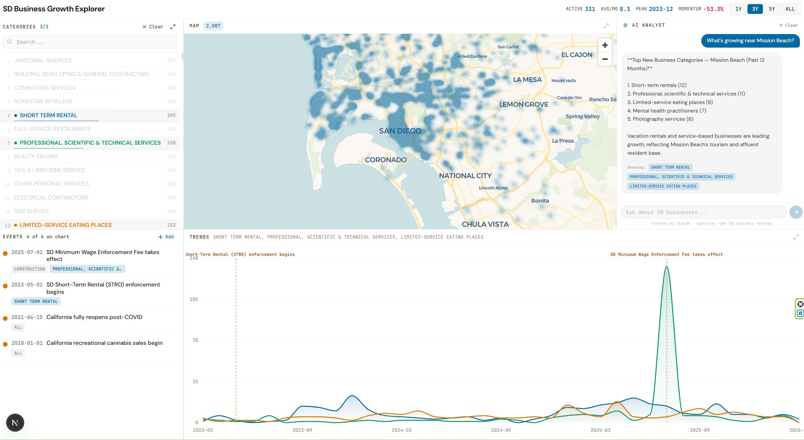
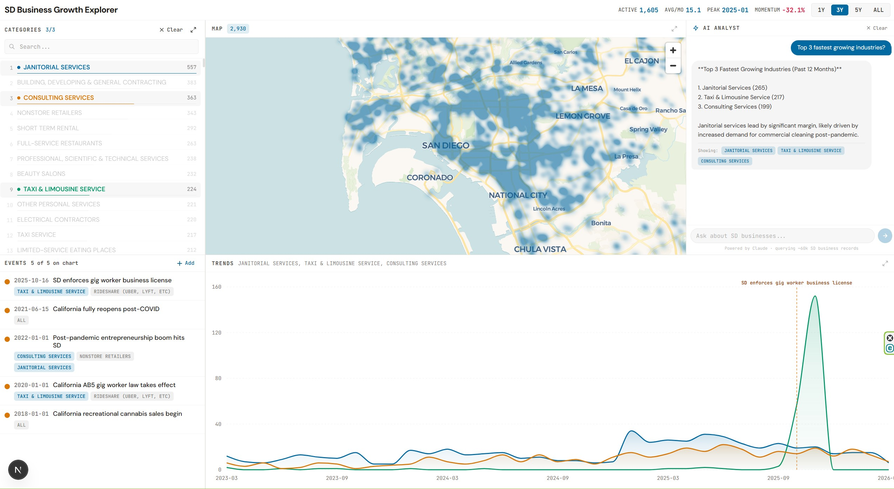

# SD Business Growth Explorer


A real-time dashboard for exploring San Diego business license trends, built for the **Claude Community x City of San Diego Impact Lab Hackathon**.

## Team

- **Team Name:** Alex
- **Members:** Alex Ham (solo)

## Problem Statement

San Diego issues thousands of business licenses every year, but the raw data is buried in a 60,000+ row CSV on the city's open data portal. Residents, policymakers, and entrepreneurs have no easy way to answer questions like:

- *Is my industry growing or shrinking in San Diego?*
- *What types of businesses are opening near my neighborhood?*
- *How did policy changes (gig worker laws, short-term rental enforcement, minimum wage hikes) affect business creation?*

Without accessible tooling, this valuable civic data goes underutilized.

## Solution

**SD Business Growth Explorer** transforms the city's raw business license dataset into an interactive, queryable dashboard. Users can:

- **Explore trends** — Select up to 3 business categories and see monthly creation rates on an interactive time-series chart
- **Compare categories** — A ranked leaderboard of all ~500 business categories, searchable and sortable by recent activity
- **See geographic patterns** — A live heatmap of business locations across San Diego, color-coded to match selected categories
- **Understand context** — Milestone events (policy changes, economic shifts) are overlaid on the chart to explain data spikes
- **Ask questions in plain English** — An AI Analyst powered by Claude answers natural language questions like "What's growing near Mission Beach?" or "Compare taxi vs rideshare trends," automatically selecting the relevant categories and querying the dataset

## Screenshots

**Dashboard overview** — category leaderboard, heatmap, trend chart, and event timeline


**AI Analyst: "What's growing near Mission Beach?"** — Claude queries the dataset and auto-selects relevant categories


**AI Analyst: "Top 3 fastest growing industries?"** — structured response with chart and map updating in sync


## City Data Sources

- **San Diego Business Tax Certificates** — from [data.sandiego.gov](https://data.sandiego.gov/datasets/business-listings/)
  - Businesses operating in San Diego must obtain a tax certificate from the City Treasurer
  - Dataset includes all active and inactive certificates issued since 1990
  - ~60,000 active certificate records used in this dashboard
  - Fields used: NAICS description (industry category), account creation date, latitude/longitude, DBA name

## Architecture

| Layer | Components |
|-------|-----------|
| **Frontend** | Leaderboard (categories), Trend Chart (Recharts), Heatmap (MapLibre GL), AI Analyst (Chat) |
| **API Routes** | `/api/trends` `/api/market` `/api/locations` `/api/leaderboard` `/api/categories` `/api/events` |
| **AI** | `/api/ask` → Claude Haiku 4.5 with 6 tools (agentic tool-use loop) |
| **Data** | CSV Cache — 60k records parsed once with PapaParse, held in-memory |

### Claude's Role

Claude powers the **AI Analyst** panel — a conversational interface where users ask natural language questions about San Diego business data. Under the hood:

1. User question hits `/api/ask`
2. Claude (Haiku 4.5) receives the question with 6 available tools:
   - `get_top_categories` — top categories by creation count
   - `get_category_trends` — monthly time series for specific categories
   - `get_market_overview` — total market activity
   - `search_categories` — fuzzy search across ~500 NAICS categories
   - `get_businesses_near_location` — geographic queries by neighborhood/landmark
   - `get_events` — milestone events in the dataset
3. Claude calls tools as needed (agentic loop), each tool queries the in-memory CSV cache directly — no extra HTTP round-trips
4. Claude returns a concise, structured answer
5. The dashboard auto-selects the relevant categories so the chart, map, and leaderboard update to match the AI's response

### Tech Stack

- **Next.js 16** (App Router, TypeScript)
- **Tailwind CSS v4** + **shadcn/ui**
- **Recharts** — time-series area charts
- **MapLibre GL JS** — interactive heatmap with CARTO tiles
- **PapaParse** — CSV parsing, cached in-memory
- **Anthropic SDK** — Claude Haiku 4.5 with tool use

## Getting Started

```bash
# Install dependencies
npm install

# Set your Anthropic API key (for the AI Analyst feature)
echo "ANTHROPIC_API_KEY=your-key-here" > .env.local

# Place the SD business CSV in the parent directory
# Download from: https://data.sandiego.gov/datasets/business-listings/
cp sd_businesses_active_datasd.csv ../

# Run the dev server
npm run dev
```

Open [http://localhost:3000](http://localhost:3000).

## Live Application

*Deployed URL here if applicable*

## Demo

*60-second demo video link here*
